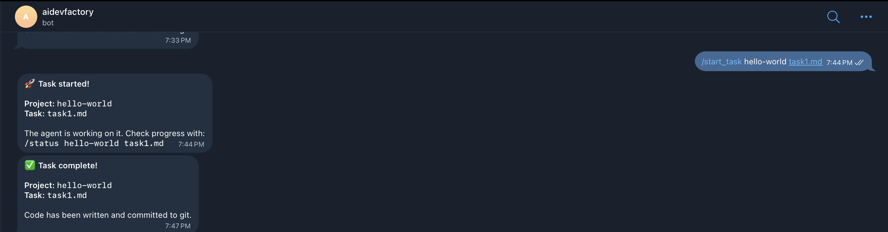

# AI Dev Factory

AI Dev Factory is an opinionated orchestration repo for building, testing and iterating agent-driven developer workflows. It provides a full local stack (LLM, router, agent controller, Telegram interface, and example projects) that you can adapt for your own projects — not just local LLM experiments.

This repository bundles:

- `docker-compose.yml` — service orchestration for the AI stack and example apps
- `agent/` — agent controller that reads task files, calls an LLM, writes files, runs commands and commits to git
- `llm/` — LLM router and provider adapters (Ollama, Claude, Deepseek)
- `telegram-bot/` — Telegram interface for sending commands and free-text tasks
- `projects/` — example projects and a scaffolding mechanism for adding your own
- `testing/` — Playwright / device test harnesses and screenshots
- `shared/` — reusable docs and coding rules for templates and new projects

This README explains how to run the stack, how tasks work, and how to adapt the system for your own projects.

## High-level overview

- The `telegram-bot` service is the user-facing entry point. It accepts commands and free-text instructions.
- The `agent-controller` manages tasks: it loads project context, calls the `llm-router`, writes files into project folders, runs commands, and commits to git.
- The `llm-router` selects a provider (local `ollama` by default) and returns generated code/patches.
- Projects live in `projects/<project>/`. Each project should include a `PROJ_DEFINATION.md` that describes the code layout. The agent uses that file to infer target file paths.

## Quick start (run locally)

Prerequisites

- Docker & Docker Compose
- A `.env` file at the repo root with at least:

```env
# Telegram
TELEGRAM_TOKEN=your_telegram_bot_token_here

# Get your chat ID by messaging @userinfobot on Telegram
ALLOWED_CHAT_IDS=your_allowed_chat_ids_here

# LLM APIs
DEEPSEEK_API_KEY=your_deepseek_api_key_here
CLAUDE_API_KEY=your_claude_api_key_here
OLLAMA_MODEL=qwen2.5-coder:7b # ollama | deepseek | claude
DEFAULT_MODEL=ollama
```

Start everything:

```bash
docker compose up -d --build
```

Start only the example app (frontend + backend):

```bash
docker compose up -d --build hello-world-api hello-world-web
```

Open the frontend:

```text
http://localhost:5174
```

Tail logs for investigation:

```bash
docker compose logs -f agent-controller
docker compose logs -f telegram-bot
```

Stop the stack:

```bash
docker compose down
```

## Projects (what's inside `projects/`)

Each project follows a simple layout and provides a `PROJ_DEFINATION.md` that describes the code layout. The agent uses that file to resolve where tasks should apply.

- `projects/hello-world/` — Minimal full-stack example included to verify the stack. Contains:
  - `frontend/` — Vite + React app (main file: `frontend/src/App.jsx`)
  - `backend/` — Express app (main file: `backend/src/index.js`)
  - `tasks/` — markdown tasks that the agent reads and executes
  - `PROJ_DEFINATION.md` — canonical project definition used by the agent

You can add your own project under `projects/your-app/` and include a `PROJ_DEFINATION.md` describing where the frontend/backend live.

## How tasks work (short)

1. Write a task file in `projects/<project>/tasks/<task>.md` (or use the bot to create one).
2. Trigger the task with Telegram or `POST /task` on the agent:

   - Telegram: `/start_task <project> <task>` or send free-text like `Change heading to "X"` (bot creates `.taskN.md`).
   - API: `POST http://localhost:5000/task { project: "hello-world", task: "task1.md" }`

3. Agent `task-runner`:
   - Loads `PROJ_DEFINATION.md` (primary), `ARCHITECTURE.md`, and `CODING_RULES.md` for context
   - For simple, explicit edits (e.g. change a heading), the agent can perform a direct update without calling the LLM
   - Otherwise the agent calls `llm-router` and expects a JSON response with `summary`, `files`, and optional `commands`
   - `file-writer` writes files into `projects/<project>/` (the repo mounts `./projects` into the agent container so edits are persistent on disk)
   - `git-manager` commits the changes in the project repo
   - Status is updated in Redis and the bot notifies the user

### Example task (short form)

Task content can be short if `PROJ_DEFINATION.md` exists. For example, `task1.md` may simply be:

```
Change the frontend page heading to AI DEV FACTORY
```

The agent will infer `frontend/src/App.jsx` from the `PROJ_DEFINATION.md` and apply the change.

## Telegram bot usage

1. Add your bot token to `.env` (`TELEGRAM_TOKEN`).
2. Start the stack and open Telegram to your bot.
3. Commands you can use:
   - `/start_task <project> <task>` — run an existing task file
   - `/status <project> <task>` — check task status
   - `/tasks <project>` — list tasks
   - `/new_project <name>` — scaffold a new project skeleton (creates `PROJ_DEFINATION.md`)
   - Send free-text instructions — the bot creates a `.taskN.md` and runs it

Example free-text message:

```
Change the heading to "AI DEV FACTORY"
```

When a task runs, the bot reports progress and posts a completion message with the project and task name.

### Screenshot



## Creating new projects programmatically

Use the agent endpoint to scaffold a new project:

```bash
curl -X POST http://localhost:5000/project -H 'Content-Type: application/json' -d '{"name":"my-app"}'
```

This creates the directory structure and default definition files (`PROJ_DEFINATION.md`, `ARCHITECTURE.md`, `CODING_RULES.md`, `tasks/001-example.md`).

## Development notes for contributors

- Project code is mounted into the agent container via Docker volumes (`./projects:/projects`) so edits are directly written to disk and tracked by git in `projects/<project>`.
- The agent prefers `PROJ_DEFINATION.md` for task context — keep it minimal and explicit (paths to key files).
- If the LLM is slow, the agent has a longer timeout for local providers and will attempt simple direct edits first.

## Useful commands (recap)

```bash
# Start full stack
docker compose up -d --build

# Start example project services only
docker compose up -d --build hello-world-api hello-world-web

# View agent logs
docker compose logs -f agent-controller

# Create a project scaffold
curl -X POST http://localhost:5000/project -H 'Content-Type: application/json' -d '{"name":"my-app"}'
```

## Licensing

Add a license file when you open source this repository.
